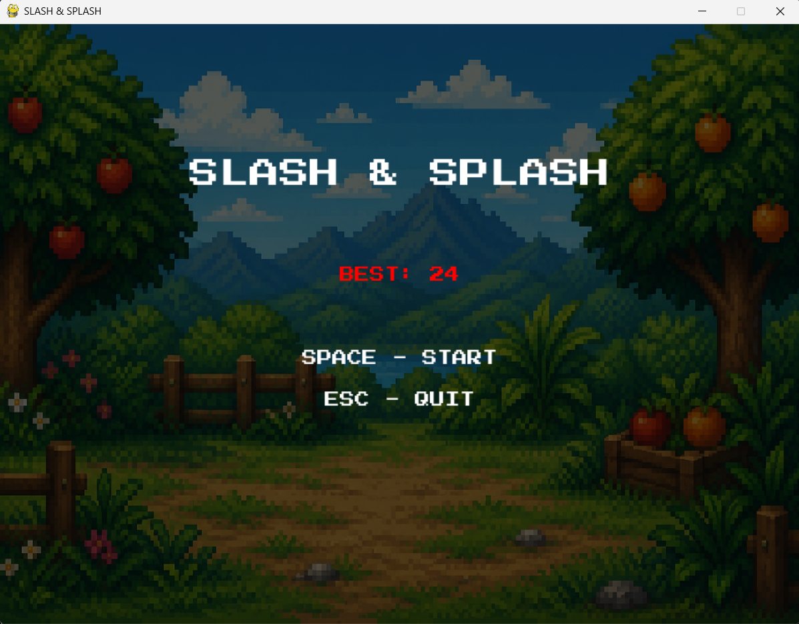

## 🍉 SLASH & SPLASH

**Real-Time Hand Gesture–Controlled Fruit Slicing Game**
Built with Python, OpenCV, MediaPipe, and Pygame.

Slash & Splash is a webcam-based arcade game where you slice flying fruit using nothing but hand gestures — no mouse, no keyboard. A computer vision pipeline tracks your hand in real time, detects slicing motions, and translates them into in-game actions.

---

## 🎮 Demo



---

## ✨ Features

- **Real-time hand tracking** using MediaPipe's hand landmark model
- **Gesture-based slicing** — swipe your hand through the air to slash fruit
- **Dynamic fruit spawning** with randomized trajectories and physics
- **Collision detection** between hand position and fruit hitboxes
- **Bomb mechanic** — slice a bomb and lose a life / end the game
- **Splash effects** on successful slices for visual feedback
- **Score tracking and persistent high score** (`highscore.txt`)
- **Lives system** with game-over and restart flow

---

## 🛠️ Tech Stack

| Component | Library |
|---|---|
| Hand tracking & gesture recognition | [MediaPipe](https://developers.google.com/mediapipe) |
| Webcam input & image processing | [OpenCV](https://opencv.org/) |
| Game loop, rendering, sound | [Pygame](https://www.pygame.org/) |
| Numerical operations | [NumPy](https://numpy.org/) |

---

## ⚙️ How It Works

1. **Webcam Capture** — OpenCV captures live video frames from the webcam.
2. **Hand Tracking** (`hand_tracker.py`) — MediaPipe detects hand landmarks in each frame and returns the position of key points (e.g., fingertip/palm).
3. **Gesture Detection** (`gesture.py`) — Tracks hand movement across frames to detect "slash" motions based on speed and direction.
4. **Game Logic** (`game.py`, `main.py`) — Spawns fruits (`fruit.py`) and bombs (`bomb.py`) at randomized positions and trajectories.
5. **Collision Detection** (`collision.py`) — Checks whether the detected slash path intersects with any fruit/bomb on screen.
6. **Feedback** (`splash.py`) — Renders a juice splash effect and updates the score when a fruit is sliced.
7. **Persistence** — High scores are saved to and loaded from `highscore.txt`.

---

## 📦 Installation

### Prerequisites
- Python 3.8 – 3.11 (MediaPipe compatibility)
- A working webcam

### Setup

```bash
# Clone the repository
git clone https://github.com/shravya33/slash-and-splash.git
cd slash-and-splash

# (Recommended) Create a virtual environment
python -m venv venv
source venv/bin/activate   # On Windows: venv\Scripts\activate

# Install dependencies
pip install -r requirements.txt
```

### Verify your setup

```bash
python test_setup.py
```

This checks that your webcam, OpenCV, and MediaPipe are working correctly before launching the game.

---

## ▶️ Usage

```bash
python main.py
```

- Position yourself in front of your webcam.
- Swipe your hand through the air to slice fruit as it appears on screen.
- Avoid slicing bombs — they cost you a life!
- Try to beat your high score before you run out of lives.


<!--
## 📁 Project Structure

```
slash-and-splash/
├── assets/            # Images, sprites, and sound effects
├── main.py            # Entry point — starts the game
├── game.py            # Core game loop and state management
├── hand_tracker.py    # MediaPipe-based hand landmark detection
├── gesture.py         # Slash gesture detection logic
├── fruit.py           # Fruit object class and behavior
├── bomb.py            # Bomb object class and behavior
├── collision.py       # Collision detection between hand and objects
├── splash.py          # Juice splash visual effects
├── config.py          # Game constants and configuration
├── highscore.txt       # Stores persistent high score
├── test_setup.py       # Verifies webcam/CV environment setup
└── requirements.txt     # Python dependencies
```
-->

<!--
## 🚀 Future Improvements

- [ ] Two-hand support for dual-blade slicing
- [ ] Difficulty levels with increasing fruit speed/spawn rate
- [ ] Combo scoring for multi-fruit slices
- [ ] On-screen hand-tracking overlay for debugging/demo mode
- [ ] Sound effects and background music toggle

-->
